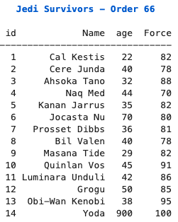
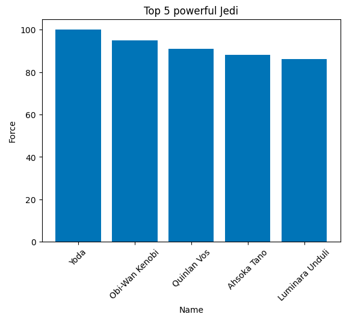
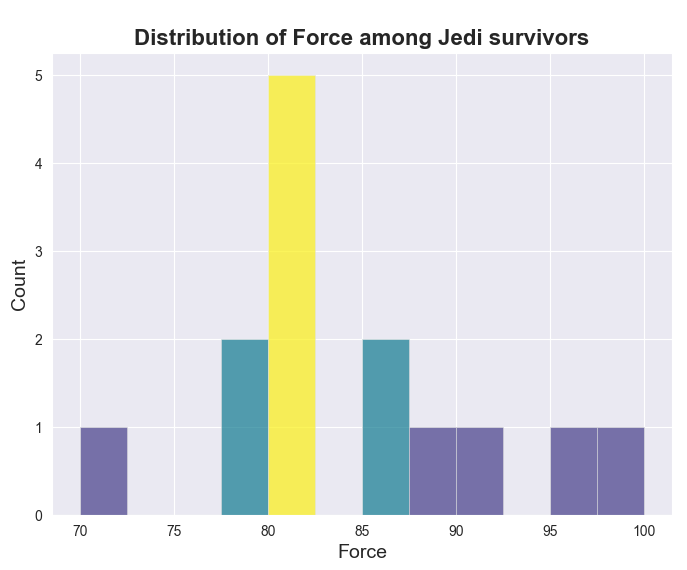

# Order_66
Playing with numpy, pandas &amp; matplotlib using data from the infamous Palpatine's order 66

Order_66 is a project that showcases a list of Jedi who survived Order 66. It provides a formatted table of the Jedi survivors and a histogram of the top 5 most powerful Jedi.

## Table of Contents
- [Installation](#installation)
- [Usage](#usage)
- [Contributing](#contributing)

## Installation

To use this project, follow these steps:

1. Clone the repository: `git clone https://github.com/your-username/jedi-survivors.git`
2. Install the required dependencies: `pip install numpy pandas matplotlib seaborn`

## Usage

1. Open the `jedi_survivors.py` file.
2. Modify the `jedi_data` array to include your desired Jedi survivors.
3. Run the script: `python jedi_survivors.py`.
4. The formatted table of Jedi survivors will be displayed in the console.

6. A histogram of the top 5 most powerful Jedi will be shown in a separate window.

7. Alternately you can play with the file seaborn_test.py to try some interesting styling features from the Seaborn library.

## Contributing

Contributions are welcome! If you have any suggestions, bug reports, or feature requests, please open an issue or submit a pull request.

